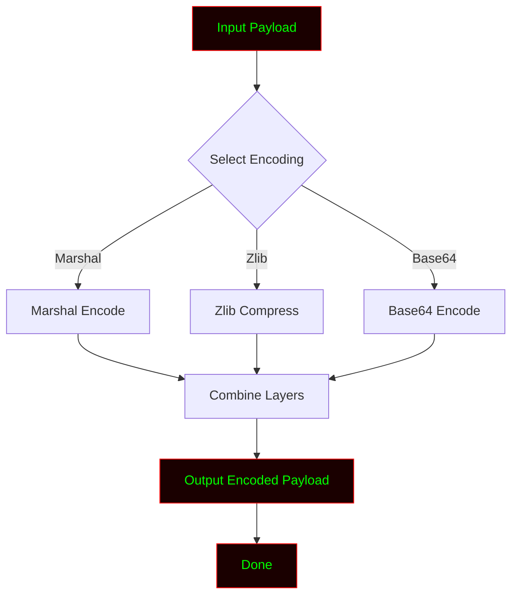

# ENC

<!-- ═══════════════════════════════════════════════════════════════════════ -->
<!--                        ENC - README.md                                  -->
<!--              Professional Payload Encoder Documentation                 -->
<!-- ═══════════════════════════════════════════════════════════════════════ -->

<div align="center">

<!-- Animated Header Banner -->


<!-- Typing Animation -->


<br>

<!-- Status Badges -->
<p>


</p>

<p>


</p>

<br>

<!-- Matrix Rain GIF -->


</div>

---

<div align="center">


                [ Encode | Obfuscate | Bypass ]
```

</div>

---

## ⚠️ Legal Disclaimer

<div align="center">

```
╔══════════════════════════════════════════════════════════════════════╗
║                                                                      ║
║   ENC (MAX OD) is a payload encoder and obfuscation tool built for   ║
║   EDUCATIONAL and AUTHORIZED testing purposes only.                  ║
║                                                                      ║
║   ▸ Use ONLY on systems you own or have permission to test.          ║
║   ▸ Unauthorized use of encoded payloads is ILLEGAL.                 ║
║   ▸ The author is NOT responsible for any misuse or damage.          ║
║                                                                      ║
║   Hack responsibly. Learn ethically. Report responsibly.             ║
║                                                                      ║
╚══════════════════════════════════════════════════════════════════════╝
```

</div>

---

## 🎯 Overview

> **ENC (MAX OD)** is a Python-based **payload encoder and obfuscation tool** designed for **security researchers, red teamers, and penetration testers**. It allows you to encode payloads using multiple layers of **Marshal, Zlib, Base16, Base32, and Base64** — making them harder to detect by signature-based scanners.

Whether you're testing antivirus evasion or studying obfuscation techniques — ENC gives you the **flexibility and power** you need.

---

## ✨ Encoding Options

<div align="center">

| Option | Encoding Type |
|:------:|:-------------|
| `[01]` | Encode Marshal |
| `[02]` | Encode Zlib |
| `[03]` | Encode Base16 |
| `[04]` | Encode Base32 |
| `[05]` | Encode Base64 |
| `[06]` | Encode Zlib, Base16 |
| `[07]` | Encode Zlib, Base32 |
| `[08]` | Encode Zlib, Base64 |
| `[09]` | Encode Marshal, Zlib |
| `[10]` | Encode Marshal, Base16 |
| `[11]` | Encode Marshal, Base32 |
| `[12]` | Encode Marshal, Base64 |
| `[13]` | Encode Marshal, Zlib, B16 |
| `[14]` | Encode Marshal, Zlib, B32 |
| `[15]` | Encode Marshal, Zlib, B64 |
| `[16]` | Simple Encode |
| `[17]` | Exit |

</div>

---

## 🚀 Installation

<div align="center">

</div>

### ⚡ One-Line Install

```bash
git clone https://github.com/anonmoty/ENC.git && cd ENC && python ENCODE.py
```

### 🐧 Linux / 🍎 macOS

```bash
# Step 1 — Clone the repo
git clone https://github.com/anonmoty/ENC.git

# Step 2 — Enter the directory
cd ENC

# Step 3 — Run the encoder
python ENCODE.py
```

### 🪟 Windows (PowerShell)

```powershell
git clone https://github.com/anonmoty/ENC.git
cd ENC
python ENCODE.py
```

---

## 🎯 Usage

```bash
# Run the tool
python Enc.py

# Then select an encoding option from the menu
[+] Option : 9
```

### Example

```
[01] Encode Marshal
[02] Encode Zlib
...
[09] Encode Marshal, Zlib
...
[17] Exit

[-] Option : 9
```

---

## 🧠 How It Works



1. **Input** — Takes raw payload
2. **Select** — Choose encoding method
3. **Encode** — Apply one or more layers
4. **Output** — Generates obfuscated payload

---

## 📁 Project Structure

```
ENC/
├── Enc.py                    # Main entry point
├── core/
│   ├── __init__.py
│   ├── encoder.py            # Encoding engine
│   └── marshal.py            # Marshal wrapper
├── payloads/                 # Sample payloads
├── output/                   # Encoded output
├── requirements.txt
├── LICENSE
└── README.md
```

---

## 📸 Demo

<div align="center">

```
╔═════════════════════════════════════════════════════════════╗
║  ███╗   ███╗ █████╗ ██╗  ██╗    ██████╗ ██████╗              ║
║  ████╗ ████║██╔══██╗╚██╗██╔╝   ██╔═══██╗██╔══██╗             ║
║  ██╔████╔██║███████║ ╚███╔╝    ██║   ██║██║  ██║             ║
║  ██║╚██╔╝██║██╔══██║ ██╔██╗    ██║   ██║██║  ██║             ║
║  ██║ ╚═╝ ██║██║  ██║██╔╝ ██╗   ╚██████╔╝██████╔╝             ║
║  ╚═╝     ╚═╝╚═╝  ╚═╝╚═╝  ╚═╝    ╚═════╝ ╚═════╝              ║
╚═════════════════════════════════════════════════════════════╝

[✓] Payload Loaded
[✓] Encoding Method: Marshal + Zlib
[→] Encoding...

[████████████████████████░░░░░░] 80% | Encoding...
[✓] Encoded Successfully
[✓] Output: output/payload_encoded.txt

        Happy Hacking! 🎯
```

</div>

---

## 🛠️ Requirements

```txt
colorama>=0.4.6
```

Install:

```bash
pip install -r requirements.txt
```

---

## 🎨 Hacker Terminal Theme

ENC uses a **red + green** theme by default:

```python
THEME = {
    "primary":   "\033[38;5;196m",  # Bright Red
    "secondary": "\033[38;5;46m",   # Matrix Green
    "accent":    "\033[38;5;214m",  # Amber
    "error":     "\033[38;5;196m",  # Red
    "warning":   "\033[38;5;220m",  # Yellow
    "info":      "\033[38;5;51m",   # Cyan
    "reset":     "\033[0m",         # Reset
}
```

---

## 🔥 Use Cases

- 🧪 **Payload obfuscation** for red team engagements
- 🛡️ **AV evasion testing** in controlled labs
- 📚 **Learning encoding layers** in Python
- 🔍 **Understanding signature bypass** techniques
- 🎯 **CTF challenges** and security research

---

## 🗺️ Roadmap

- [x] Marshal encoding
- [x] Zlib compression
- [x] Base16/32/64 encoding
- [x] Multi-layer combinations
- [ ] AES encryption layer
- [ ] XOR encoding
- [ ] Custom key support
- [ ] Batch encoding
- [ ] CLI arguments
- [ ] pip package

---

## 🤝 Contributing

Contributions are welcome. Please follow these steps:

1. Fork the repository
2. Create your branch (`git checkout -b feature/amazing-feature`)
3. Commit your changes (`git commit -m 'Add amazing feature'`)
4. Push to the branch (`git push origin feature/amazing-feature`)
5. Open a Pull Request

---

## 📜 License

Distributed under the **MIT License**. See [`LICENSE`](LICENSE) for more information.

---

## 🙏 Credits

- **Author:** MAX OD
- **GitHub:** [@anonmoty](https://github.com/anonmoty)
- **Telegram:** [@MAXOD0](https://t.me/MAXOD0)
- **WhatsApp:** +91 9710569549857
- **Built with:** Python, caffeine, and curiosity ☕

---

<div align="center">


<br><br>

### ⭐ If this tool helped you, drop a star!


</div>
